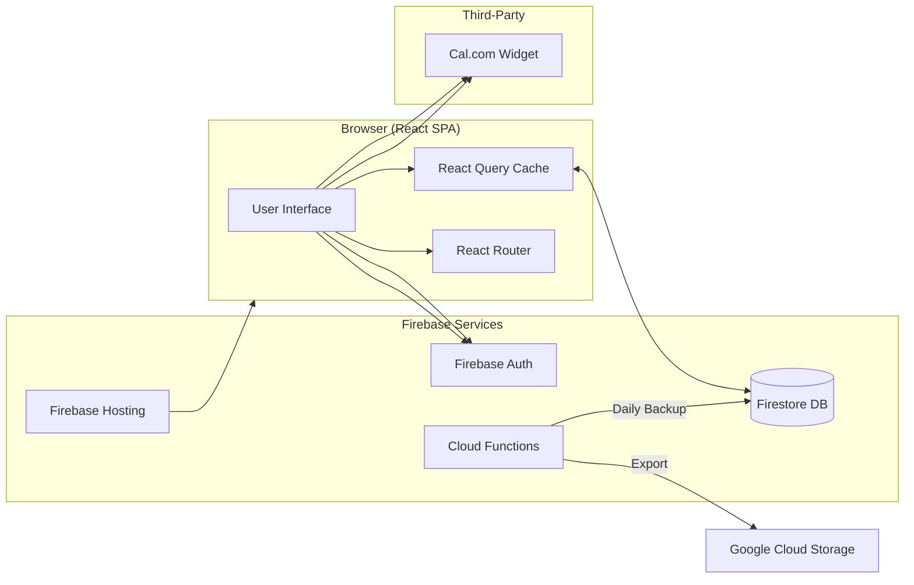
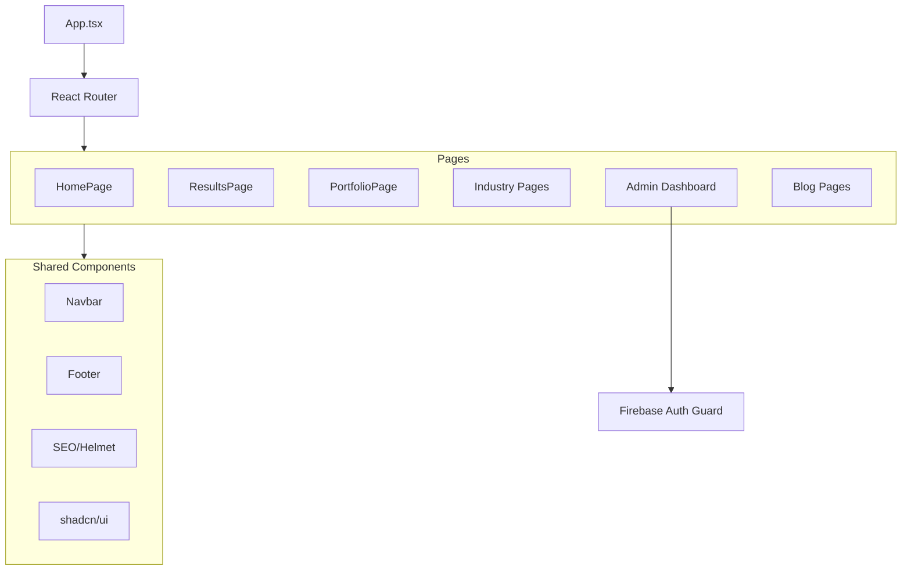

# Architecture Documentation

## System Overview

MerkadAgency is a Single Page Application (SPA) for lead generation and client showcase, served via Firebase Hosting with Firebase backend services.

---

## Data Flow



---

## Component Relationships



---

## Route Map

| Route | Component | Access |
|-------|-----------|--------|
| `/` | HomePage | Public |
| `/results` | ResultsPage | Public |
| `/portfolio/:slug` | PortfolioPage | Public |
| `/about` | AboutPage | Public |
| `/our-method` | OurMethodPage | Public |
| `/blog` | BlogPage | Public |
| `/blog/:slug` | BlogPostPage | Public |
| `/industries/medspas` | MedspasPage | Public |
| `/industries/cannabis` | CannabisPage | Public |
| `/industries/construction` | ConstructionPage | Public |
| `/admin/login` | AdminLogin | Public |
| `/admin` | AdminDashboard | Protected (Google Auth) |
| `/legal/privacy` | PrivacyPage | Public |
| `/legal/terms` | TermsPage | Public |
| `*` | NotFound | Public |

---

## Directory Structure

```
/
├── public/                  # Static assets (images, favicon)
├── src/
│   ├── components/
│   │   ├── ui/              # shadcn/ui primitives
│   │   ├── admin/           # Admin-specific components
│   │   ├── home/            # Homepage sections
│   │   ├── layout/          # Navbar, Footer
│   │   ├── portfolio/       # Case study components
│   │   └── shared/          # Reusable across pages
│   ├── hooks/               # Custom React hooks
│   ├── lib/
│   │   ├── firebase.ts      # Firebase initialization
│   │   └── utils.ts         # Utility functions
│   ├── pages/
│   │   ├── admin/           # Protected admin routes
│   │   ├── blog/            # Blog pages
│   │   ├── case-studies/    # Case study hub
│   │   ├── industries/      # Industry landing pages
│   │   └── legal/           # Privacy, Terms
│   ├── App.tsx              # Root component + routing
│   ├── main.tsx             # React DOM entry
│   └── index.css            # Global styles + Tailwind
├── checkpoints/             # Development milestones
├── .env.example             # Environment template
└── [config files]           # vite, tailwind, tsconfig, etc.
```

---

## Key Integrations

### Firebase Auth
- **Provider**: Google OAuth only
- **Protected routes**: `/admin/*`
- **Guard**: `ProtectedRoute` component wraps admin routes
- **Allowed users**: Whitelist in Firestore `admin_users` collection

### Cal.com Widget
- **Purpose**: Booking discovery calls
- **Implementation**: Embedded via Cal.com's JS SDK
- **Note**: Requires DOM fully rendered before init (see DECISIONS.md #004)

### React Query (TanStack)
- **Purpose**: Server state management and caching
- **Usage**: Firestore document fetching with automatic cache invalidation

---

## Design System

| Token | Value | Usage |
|-------|-------|-------|
| Primary | `hsl(262, 83%, 58%)` | CTAs, accents |
| Background | `hsl(222, 47%, 11%)` | Dark mode base |
| Typography | Inter, Outfit | Body, headings |

See `tailwind.config.ts` for complete token definitions.

---

## Related Documentation

- [DECISIONS.md](./DECISIONS.md) — Why specific technical choices were made
- [CONTRIBUTING.md](./CONTRIBUTING.md) — Code style and commit conventions
- [SETUP.md](./SETUP.md) — Environment setup instructions
