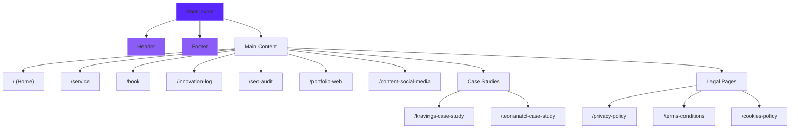
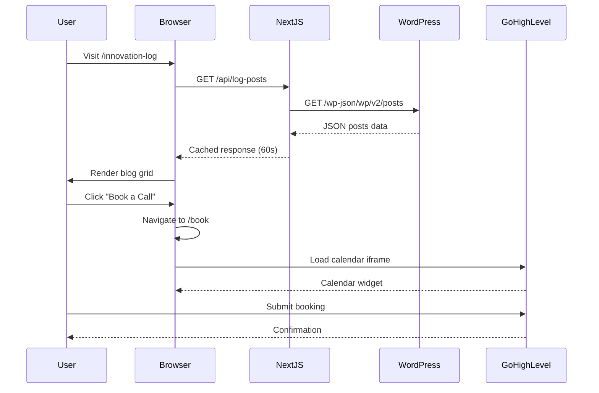
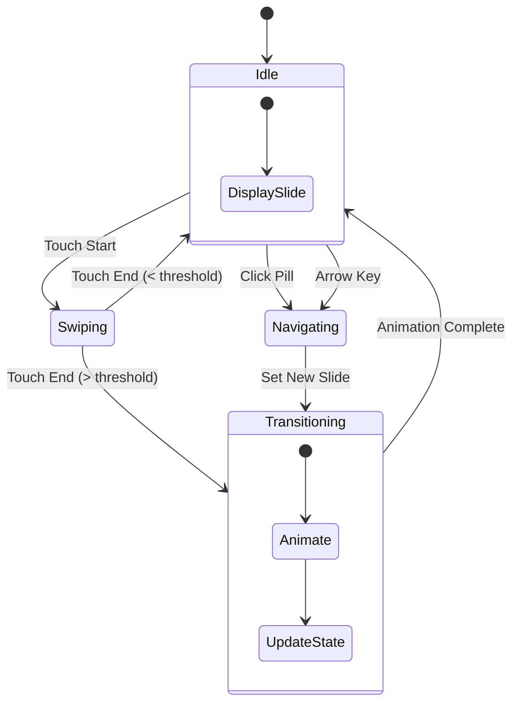

# MerkadAgency - Application Architecture Documentation

[](https://nextjs.org/)
[](https://reactjs.org/)
[](https://www.typescriptlang.org/)
[](https://tailwindcss.com/)

> Last Updated: December 2025 | Version: 0.1.0

---

## 📋 Table of Contents

1. [Project Summary](#-project-summary)
2. [Folder Structure](#-folder-structure)
3. [Module & Component Map](#-module--component-map)
4. [Data Flow & Workflow](#-data-flow--workflow)
5. [Dependencies & External Services](#-dependencies--external-services)
6. [Feature List](#-feature-list)
7. [Architecture & Design Patterns](#-architecture--design-patterns)
8. [Potential Weaknesses & Risks](#-potential-weaknesses--risks)
9. [Architecture Diagrams](#-architecture-diagrams)
10. [How to Navigate & Contribute](#-how-to-navigate--contribute)
11. [Maintenance Notes](#-maintenance-notes)

---

## 🎯 Project Summary

### Purpose
**MerkadAgency** is a marketing agency website showcasing AI-powered growth services. It serves as both a marketing platform and lead generation system for the agency.

### Business Value
- Lead capture and booking funnel for strategy calls
- Service portfolio showcase with case studies
- SEO-optimized content hub (Innovation Log) for organic traffic
- Professional credibility through visual design and case study proof

### Core Functionality
- **Service Showcase**: Interactive carousel presenting 5 AI marketing services
- **Lead Capture**: Integrated booking system and newsletter signup via GoHighLevel
- **Content Hub**: WordPress-powered blog proxied through Next.js API routes
- **Case Studies**: Detailed project showcases demonstrating client results
- **SEO Audit Tool**: Lead magnet offering free website analysis

### Tech Stack Overview
| Layer | Technology |
|-------|------------|
| Framework | Next.js 16 (App Router) |
| UI Library | React 19 |
| Language | TypeScript 5 |
| Styling | Tailwind CSS 4 + Global CSS |
| Deployment | Vercel (recommended) |
| CRM/Forms | GoHighLevel |
| Content | WordPress REST API |

---

## 📁 Folder Structure

```
merkadagency/
├── public/                          # Static assets
│   └── images/                      # Self-hosted images
│       └── merkadagency-logo.png    # Company logo
│
├── src/
│   ├── app/                         # Next.js App Router (pages)
│   │   ├── layout.tsx               # Root layout (Header/Footer wrapper)
│   │   ├── page.tsx                 # Homepage
│   │   ├── globals.css              # Global styles + design tokens (~87KB)
│   │   │
│   │   ├── service/                 # Services showcase
│   │   │   ├── page.tsx             # Interactive service carousel
│   │   │   └── layout.tsx           # SEO metadata
│   │   │
│   │   ├── book/                    # Booking page
│   │   │   ├── page.tsx             # GoHighLevel calendar embed
│   │   │   ├── page.module.css      # Page-specific styles
│   │   │   └── layout.tsx           # SEO metadata
│   │   │
│   │   ├── ai-lead-capture/         # Service deep-dive page
│   │   │   ├── page.tsx             # AI Lead Capture feature page
│   │   │   ├── page.module.css      # CSS Modules styling
│   │   │   └── layout.tsx           # SEO metadata
│   │   │
│   │   ├── seo-audit/               # SEO audit lead magnet
│   │   │   └── page.tsx             # Audit form + samples
│   │   │
│   │   ├── innovation-log/          # Blog/content hub
│   │   │   ├── page.tsx             # WordPress posts grid
│   │   │   └── page.module.css      # Blog-specific styles
│   │   │
│   │   ├── portfolio-web/           # Web portfolio showcase
│   │   │   └── page.tsx             # Project cards grid
│   │   │
│   │   ├── content-social-media/    # Video portfolio
│   │   │   └── page.tsx             # Filterable video gallery
│   │   │
│   │   ├── crm-automation/          # CRM service page
│   │   │   └── page.tsx             # CRM features + modal
│   │   │
│   │   ├── kravings-case-study/     # Case study page
│   │   │   └── page.tsx             # E-commerce case study
│   │   │
│   │   ├── teonanatcl-case-study/   # Case study page
│   │   │   └── page.tsx             # Wellness site case study
│   │   │
│   │   ├── privacy-policy/          # Legal page
│   │   ├── terms-conditions/        # Legal page
│   │   ├── cookies-policy/          # Legal page
│   │   │
│   │   └── api/                     # API Routes
│   │       ├── log-posts/           # WordPress posts proxy
│   │       │   └── route.ts         # GET /api/log-posts
│   │       └── log-categories/      # WordPress categories proxy
│   │           └── route.ts         # GET /api/log-categories
│   │
│   ├── components/                  # Shared React components
│   │   ├── Header.tsx               # Site navigation
│   │   └── Footer.tsx               # Site footer + newsletter
│   │
│   └── hooks/                       # Custom React hooks
│       ├── index.ts                 # Barrel export
│       ├── useScrollAnimation.ts    # IntersectionObserver animations
│       └── useParticles.ts          # Floating particle effects
│
├── next.config.ts                   # Next.js configuration + security headers
├── tsconfig.json                    # TypeScript configuration
├── eslint.config.mjs                # ESLint configuration
├── package.json                     # Dependencies
├── .env.example                     # Environment variables template
└── README.md                        # Project documentation
```

### Directory Roles

| Directory | Role | Key Files |
|-----------|------|-----------|
| `src/app/` | Page routes using Next.js App Router | `page.tsx` for each route |
| `src/app/api/` | Backend API routes (serverless) | `route.ts` handlers |
| `src/components/` | Shared UI components | Header, Footer |
| `src/hooks/` | Reusable React hooks | Animation, particles |
| `public/` | Static assets served at root | Images, favicon |

---

## 🧩 Module & Component Map

### Core Components

#### Header (`src/components/Header.tsx`)
| Aspect | Details |
|--------|---------|
| **Responsibility** | Site navigation, mobile menu, logo |
| **State** | `isMobileOpen` (menu toggle) |
| **Connections** | Links to all major pages |
| **Features** | Dropdown menus, responsive toggle, sticky positioning |

#### Footer (`src/components/Footer.tsx`)
| Aspect | Details |
|--------|---------|
| **Responsibility** | Site footer, social links, newsletter signup |
| **State** | None (uses external GoHighLevel script) |
| **External** | Embeds GoHighLevel newsletter form via iframe |
| **Connections** | Links to services, resources, legal pages |

### Page Components

#### Homepage (`src/app/page.tsx`)
| Aspect | Details |
|--------|---------|
| **Sections** | Hero, Services Grid, Process Timeline, Stats, CTA |
| **State** | Particles array via `useParticles` hook |
| **Animations** | Scroll-triggered fade-in, floating particles |
| **Data** | Static (services, processSteps, stats arrays) |

#### Services Page (`src/app/service/page.tsx`)
| Aspect | Details |
|--------|---------|
| **Layout** | Interactive carousel with swipe/keyboard navigation |
| **State** | `currentSlide`, touch tracking refs |
| **Features** | Category pills, animated transitions, feature lists |
| **Data** | Static services array with rich content |

#### Innovation Log (`src/app/innovation-log/page.tsx`)
| Aspect | Details |
|--------|---------|
| **Purpose** | Blog/content hub powered by WordPress |
| **State** | posts, featuredPost, categories, pagination |
| **Data Source** | `/api/log-posts`, `/api/log-categories` |
| **Features** | Category filtering, pagination, featured post |

#### Book Page (`src/app/book/page.tsx`)
| Aspect | Details |
|--------|---------|
| **Purpose** | Strategy call booking |
| **Integration** | GoHighLevel calendar iframe |
| **Features** | FAQ accordion, benefits list, mobile modal |

### Custom Hooks

#### `useParticles`
```typescript
// Input: options (interval, maxParticles, initialCount)
// Output: { particles, containerRef, isRunning, start, stop, clear }
// Purpose: React-idiomatic floating particle effects
```

#### `useScrollAnimation`
```typescript
// Input: options (threshold, rootMargin, visibleClass)
// Output: containerRef
// Purpose: IntersectionObserver-based scroll animations
```

---

## 🔄 Data Flow & Workflow

### User Journey Flow

```
┌─────────────────────────────────────────────────────────────┐
│                      USER JOURNEY                            │
├─────────────────────────────────────────────────────────────┤
│                                                              │
│  Landing (/)  →  Services (/service)  →  Book (/book)       │
│       │              │                        │              │
│       ↓              ↓                        ↓              │
│  Learn About     Deep Dive              Schedule Call        │
│  Services        Features               (GoHighLevel)        │
│       │              │                        │              │
│       └──────────────┴────────────────────────┘              │
│                      ↓                                       │
│              CRM Captures Lead                               │
│              (GoHighLevel)                                   │
│                                                              │
└─────────────────────────────────────────────────────────────┘
```

### Blog Content Flow

```
┌────────────┐      ┌──────────────┐      ┌─────────────┐
│  WordPress │ ───► │  Next.js API │ ───► │   React     │
│  REST API  │      │    Routes    │      │  Component  │
└────────────┘      └──────────────┘      └─────────────┘
     │                     │                     │
     │ /wp/v2/posts        │ /api/log-posts      │ posts state
     │ /wp/v2/categories   │ /api/log-categories │ categories state
     ↓                     ↓                     ↓
  Raw JSON            Proxied +              Rendered
  Response            Cached (60s)           Blog Grid
```

### Component Render Flow

```
1. Page Load
   └─► RootLayout renders
       ├─► Header renders (client)
       ├─► Page content renders
       │   └─► useEffect triggers
       │       ├─► useParticles initializes
       │       └─► IntersectionObserver attaches
       └─► Footer renders (client)
           └─► GoHighLevel script loads

2. User Interaction
   └─► Event (click/scroll)
       └─► State update
           └─► Re-render affected components
```

### API Route Flow

```typescript
// /api/log-posts
Client Request → Next.js Route Handler
                       ↓
              Fetch WordPress API
              (merkadagency.com/wp-json/wp/v2/posts)
                       ↓
              Add pagination headers
              (X-WP-TotalPages, X-WP-Total)
                       ↓
              Return JSON + Cache (60s revalidate)
```

---

## 📦 Dependencies & External Services

### NPM Dependencies

| Package | Version | Purpose |
|---------|---------|---------|
| `next` | 16.0.8 | React framework (App Router) |
| `react` | 19.2.1 | UI library |
| `react-dom` | 19.2.1 | React DOM bindings |
| `typescript` | 5.x | Type safety |
| `tailwindcss` | 4.0 | Utility CSS framework |
| `eslint` | - | Code linting |
| `eslint-config-next` | - | Next.js ESLint rules |

### External Services

| Service | Purpose | Integration Point |
|---------|---------|-------------------|
| **GoHighLevel** | CRM, booking, forms | Iframe embeds, external scripts |
| **WordPress** | Blog content (headless) | REST API via `/api/` routes |
| **Google Cloud Storage** | Image hosting | Remote images (logo, case studies) |
| **Google Fonts** | Typography (Inter) | CSS import in globals.css |

### External URLs

| URL | Usage |
|-----|-------|
| `link.merkadagency.com` | GoHighLevel widgets |
| `merkadagency.com/wp-json/wp/v2/` | WordPress REST API |
| `storage.googleapis.com/msgsndr/` | GCS image hosting |

---

## ✨ Feature List

### Marketing Pages

| Feature | Route | Description |
|---------|-------|-------------|
| Homepage | `/` | Hero, services overview, stats, CTA |
| Services Carousel | `/service` | Interactive showcase of 5 services |
| AI Lead Capture | `/ai-lead-capture` | Deep-dive on lead automation |
| CRM Automation | `/crm-automation` | CRM features and benefits |
| Web Portfolio | `/portfolio-web` | Website project showcase |
| Video Portfolio | `/content-social-media` | Filterable video gallery |

### Lead Generation

| Feature | Route | Description |
|---------|-------|-------------|
| Strategy Call Booking | `/book` | GoHighLevel calendar integration |
| SEO Audit Lead Magnet | `/seo-audit` | Free audit signup form |
| Newsletter Signup | Footer | GoHighLevel form embed |

### Content Hub

| Feature | Route | Description |
|---------|-------|-------------|
| Innovation Log | `/innovation-log` | WordPress-powered blog |
| Category Filtering | - | Filter posts by category |
| Pagination | - | Navigate through blog pages |
| Featured Post | - | Highlight sticky posts |

### Case Studies

| Feature | Route | Description |
|---------|-------|-------------|
| Kravings Case Study | `/kravings-case-study` | E-commerce success story |
| Teonanatcl Case Study | `/teonanatcl-case-study` | Wellness site transformation |

### Legal & Compliance

| Feature | Route | Description |
|---------|-------|-------------|
| Privacy Policy | `/privacy-policy` | Data collection disclosure |
| Terms & Conditions | `/terms-conditions` | Service terms |
| Cookies Policy | `/cookies-policy` | Cookie usage disclosure |

### API Endpoints

| Endpoint | Method | Description |
|----------|--------|-------------|
| `/api/log-posts` | GET | Proxy to WordPress posts |
| `/api/log-categories` | GET | Proxy to WordPress categories |

---

## 🏗 Architecture & Design Patterns

### Overall Architecture

**Monolithic Single-Page Application (SPA) with Static Generation**

```
┌─────────────────────────────────────────────┐
│                  Client                      │
│  (React Components + Client-Side Routing)   │
├─────────────────────────────────────────────┤
│               Next.js App Router             │
│  (Static Generation + Server Components)     │
├─────────────────────────────────────────────┤
│                API Routes                    │
│      (Serverless Functions - Proxies)       │
├─────────────────────────────────────────────┤
│             External Services               │
│   (WordPress API, GoHighLevel, GCS)         │
└─────────────────────────────────────────────┘
```

### Design Patterns Used

| Pattern | Implementation |
|---------|---------------|
| **Component Composition** | Header/Footer wrap all pages via layout.tsx |
| **Custom Hooks** | `useParticles`, `useScrollAnimation` extract reusable logic |
| **CSS Modules** | Scoped styles for complex pages (ai-lead-capture, book, innovation-log) |
| **API Proxy** | API routes hide WordPress backend from client |
| **Static Generation** | Pages pre-rendered at build time |
| **Design Tokens** | CSS custom properties in globals.css |

### Code Organization Principles

1. **Route-Based Structure**: Each page in its own directory under `src/app/`
2. **Colocation**: Page-specific CSS modules live with their pages
3. **Shared Components**: Only truly global components in `src/components/`
4. **Hooks Extraction**: Reusable stateful logic in `src/hooks/`
5. **Static Data**: Content defined as constants within page components

### Rendering Strategy

| Page Type | Strategy | Reason |
|-----------|----------|--------|
| Marketing pages | Static (SSG) | Content rarely changes |
| Blog pages | Static + ISR | Content from WordPress, revalidates |
| API routes | Dynamic | Real-time data fetch |

---

## ⚠️ Potential Weaknesses & Risks

### High Priority

| Issue | Risk | Recommendation |
|-------|------|----------------|
| **Large globals.css** (~87KB) | Slow initial paint, hard to maintain | Migrate to CSS Modules per page |
| **Hardcoded Content** | Content changes require code deploys | Consider headless CMS for all content |
| **External Script Injection** | GoHighLevel scripts could be security vector | Implement CSP headers |

### Medium Priority

| Issue | Risk | Recommendation |
|-------|------|----------------|
| **Native `` Tags** | Slower LCP, no optimization | Migrate to `next/image` |
| **No Test Coverage** | Regressions go undetected | Add Jest + React Testing Library |
| **Console Logging in API Routes** | Poor production debugging | Implement structured logging |
| **Google Fonts Import** | Render-blocking, FOIT | Use `next/font` for optimization |

### Low Priority

| Issue | Risk | Recommendation |
|-------|------|----------------|
| **Emoji as Icons** | Inconsistent cross-platform rendering | Replace with SVG icon components |
| **No Error Boundaries** | Unhandled errors crash entire app | Add React Error Boundaries |
| **Limited Accessibility** | Potential a11y issues | Add ARIA labels, keyboard navigation |

### Technical Debt

1. Duplicate animation observer logic (partially resolved with hooks)
2. Inconsistent styling approach (global CSS vs CSS Modules)
3. No loading/error states for WordPress content
4. Missing sitemap.xml and robots.txt generation

---

## 📊 Architecture Diagrams

### System Architecture


```mermaid
graph TB
    subgraph Client["Client Browser"]
        UI[React Components]
        Router[Next.js Router]
    end
    
    subgraph NextJS["Next.js Server"]
        SSG[Static Pages]
        API[API Routes]
    end
    
    subgraph External["External Services"]
        WP[WordPress API]
        GHL[GoHighLevel]
        GCS[Google Cloud Storage]
    end
    
    UI --> Router
    Router --> SSG
    UI --> API
    API --> WP
    UI -.-> GHL
    UI --> GCS
    
    style Client fill:#1a1d2e,stroke:#5A27FF
    style NextJS fill:#1a1d2e,stroke:#8B5CF6
    style External fill:#1a1d2e,stroke:#FBCBD5
```

### Page Component Hierarchy


```mermaid
graph TD
    Layout["RootLayout"]
    Header["Header"]
    Footer["Footer"]
    Main["Main Content"]
    
    Layout --> Header
    Layout --> Main
    Layout --> Footer
    
    Main --> Home["/ (Home)"]
    Main --> Service["/service"]
    Main --> Book["/book"]
    Main --> Blog["/innovation-log"]
    Main --> Audit["/seo-audit"]
    Main --> Portfolio["/portfolio-web"]
    Main --> Content["/content-social-media"]
    Main --> Cases["Case Studies"]
    Main --> Legal["Legal Pages"]
    
    Cases --> Kravings["/kravings-case-study"]
    Cases --> Teo["/teonanatcl-case-study"]
    
    Legal --> Privacy["/privacy-policy"]
    Legal --> Terms["/terms-conditions"]
    Legal --> Cookies["/cookies-policy"]
    
    style Layout fill:#5A27FF,stroke:#fff
    style Header fill:#8B5CF6,stroke:#fff
    style Footer fill:#8B5CF6,stroke:#fff
```

### Data Flow Diagram


```mermaid
sequenceDiagram
    participant User
    participant Browser
    participant NextJS
    participant WordPress
    participant GoHighLevel
    
    User->>Browser: Visit /innovation-log
    Browser->>NextJS: GET /api/log-posts
    NextJS->>WordPress: GET /wp-json/wp/v2/posts
    WordPress-->>NextJS: JSON posts data
    NextJS-->>Browser: Cached response (60s)
    Browser->>User: Render blog grid
    
    User->>Browser: Click "Book a Call"
    Browser->>Browser: Navigate to /book
    Browser->>GoHighLevel: Load calendar iframe
    GoHighLevel-->>Browser: Calendar widget
    User->>GoHighLevel: Submit booking
    GoHighLevel-->>User: Confirmation
```

### Service Carousel State Machine


```mermaid
stateDiagram-v2
    [*] --> Idle
    Idle --> Swiping: Touch Start
    Idle --> Navigating: Click Pill
    Idle --> Navigating: Arrow Key
    
    Swiping --> Idle: Touch End (< threshold)
    Swiping --> Transitioning: Touch End (> threshold)
    
    Navigating --> Transitioning: Set New Slide
    
    Transitioning --> Idle: Animation Complete
    
    state Idle {
        [*] --> DisplaySlide
    }
    
    state Transitioning {
        [*] --> Animate
        Animate --> UpdateState
    }
```

---

## 🚀 How to Navigate & Contribute

### Getting Started

```bash
# Clone the repository
git clone <repo-url>
cd merkadagency

# Install dependencies
npm install

# Start development server
npm run dev
```

Open [http://localhost:3000](http://localhost:3000) to view the site.

### Key Entry Points

| Task | Start Here |
|------|------------|
| Modify site layout | `src/app/layout.tsx` |
| Edit global styles | `src/app/globals.css` |
| Add new page | Create `src/app/{route}/page.tsx` |
| Modify header/footer | `src/components/Header.tsx` or `Footer.tsx` |
| Add reusable hook | `src/hooks/{hookName}.ts` + update `index.ts` |
| Add API endpoint | `src/app/api/{endpoint}/route.ts` |

### Development Workflow

1. **Create branch** from `main` with descriptive name
2. **Make changes** following existing patterns
3. **Run linter**: `npm run lint`
4. **Build locally**: `npm run build`
5. **Test manually** in browser
6. **Submit PR** with clear description

### Code Style Guidelines

- Use TypeScript for all new files
- Use CSS Modules for page-specific styles
- Extract reusable logic to custom hooks
- Use design tokens from globals.css
- Follow existing naming conventions

### Adding New Pages

```bash
# Create new page directory
mkdir -p src/app/{page-name}

# Create page component
touch src/app/{page-name}/page.tsx

# Optional: Add page-specific styles
touch src/app/{page-name}/page.module.css

# Optional: Add SEO metadata
touch src/app/{page-name}/layout.tsx
```

---

## 🔧 Maintenance Notes

### Build Commands

| Command | Description |
|---------|-------------|
| `npm run dev` | Start development server |
| `npm run build` | Production build |
| `npm run start` | Start production server |
| `npm run lint` | Run ESLint |

### Environment Variables

Currently no required environment variables. See `.env.example` for future configuration options.

### Caching Strategy

| Resource | Cache Duration |
|----------|----------------|
| WordPress Posts | 60 seconds (ISR) |
| WordPress Categories | 1 hour (ISR) |
| Static Pages | Indefinite (rebuild to update) |
| Images | Browser default |

### Deployment

**Recommended**: Deploy to Vercel for automatic builds, previews, and edge caching.

```bash
# Using Vercel CLI
npm i -g vercel
vercel
```

### Monitoring Checklist

- [ ] Check Vercel deployment logs after each deploy
- [ ] Monitor WordPress API availability
- [ ] Test GoHighLevel forms periodically
- [ ] Review Core Web Vitals in Google Search Console

### Update Dependencies

```bash
# Check for updates
npm outdated

# Update minor/patch versions
npm update

# Update major versions carefully
npm install <package>@latest
```

---

## 📝 Version History

| Version | Date | Changes |
|---------|------|---------|
| 0.1.0 | Dec 2025 | Initial release with code quality improvements |

---

*This documentation was auto-generated based on codebase analysis. Last updated: December 2025*
